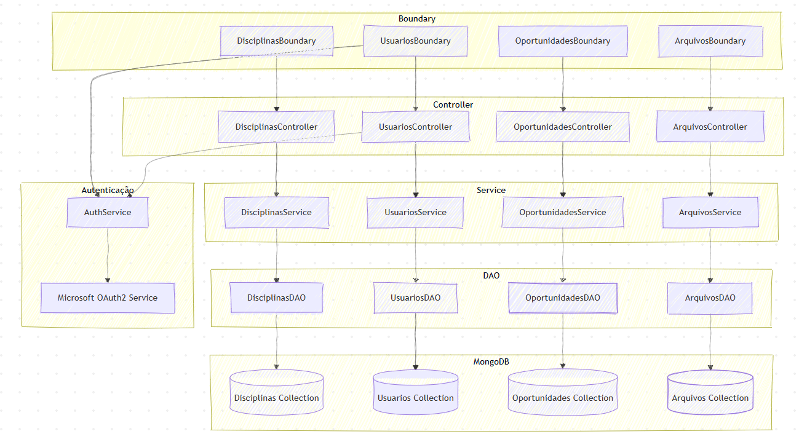
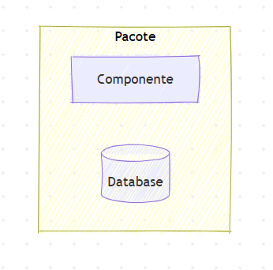

# learning-management-system

## Capítulo 1: Introdução

O projeto visa não apenas modernizar a experiência de usuário através de um design consistente e responsivo, mas também expandir o papel do LMS, transformando-o de um repositório de conteúdo em um ecossistema integrado que promove o desenvolvimento do aluno.

Para isso, propõe-se a implementação de funcionalidades de melhoria, como uma ferramenta de busca inteligente, e inovações como um sistema de recomendação de oportunidades acadêmicas e extracurriculares.

## Capítulo 2: Detalhamento do Projeto

### 2.1. Motivação

A motivação central deste projeto nasce da experiência diária como estudante universitário e da observação das dificuldades operacionais causadas pelas ferramentas de gestão de aprendizagem atualmente em uso.

A dificuldade em localizar materiais de estudo, a inconsistência na organização de conteúdo entre diferentes disciplinas e a instabilidade da plataforma resultam em interrupções no acesso ao conteúdo de aprendizagem.

Adicionalmente, identifica-se uma lacuna na centralização de informações relevantes para a jornada do aluno, como oportunidades de estágio, projetos de pesquisa e atividades de extensão, que hoje são divulgadas de forma descentralizada e assimétrica.

O objetivo é, portanto, criar uma solução que resolva esses pontos práticos e organize a experiência acadêmica, tornando-a mais fluida, integrada e personalizada.

### 2.2. Cenário Atual

O cenário de Learning Management Systems é dominado por plataformas robustas, mas que frequentemente carregam legados técnicos e de design. A análise a seguir combina a perspectiva do usuário final com tendências de mercado.

#### Perspectiva de Aluno

Como usuário direto do Moodle, os seguintes pontos são recorrentes:

- **Design e Usabilidade**: A interface é percebida como não alinhada aos padrões visuais atuais, com navegação pouco intuitiva. A falta de um padrão na estruturação do conteúdo por parte dos docentes demanda um esforço adicional do aluno para a localização de materiais em cada nova disciplina. A experiência em dispositivos móveis apresenta limitações, o que dificulta o acesso rápido a informações.

- **Desempenho e Confiabilidade**: Episódios de lentidão, indisponibilidade em períodos de alta demanda (como semanas de prova) e falhas no upload ou download de arquivos são reportados com frequência por alunos e professores. Tais ocorrências podem impactar a continuidade das atividades acadêmicas.

#### Análise de Mercado

As observações pessoais são validadas por análises mais amplas do setor de EdTech.

- **Confiabilidade como Fator Crítico**: Relatórios como o da Educause apontam consistentemente que a confiabilidade e a facilidade de uso são os fatores mais importantes para a satisfação de alunos e professores com um LMS ([Educause Horizon Report, 2023](https://library.educause.edu/-/media/files/library/2023/4/2023hrteachinglearning.pdf)). Plataformas mais modernas, nativas em nuvem, como o Canvas, utilizam essa estabilidade como um forte diferencial competitivo.

- **A Tendência de "Consumerização"**: Usuários esperam que o software educacional tenha a mesma qualidade de design e experiência de aplicativos de consumo (e.g., Spotify, Netflix). A expectativa por interfaces limpas, personalizadas e intuitivas é uma tendência de mercado que plataformas mais antigas têm dificuldade em acompanhar ([Beyond Functionality: How Consumerization of Enterprise UX is Revolutionizing Work](https://www.photonxtech.com/blogs/beyond-functionality-how-consumerization-of-enterprise-ux-is-revolutionizing-work)).

- **Ecossistemas Integrados**: A direção do mercado aponta para a criação de plataformas que servem como um "hub" central na vida do estudante, integrando-se a outras ferramentas (agendas, ferramentas de anotação) e oferecendo uma visão holística da jornada acadêmica, algo que sistemas tradicionais raramente oferecem de forma nativa.

### 2.3. Estruturação da Demanda

Com base na análise, a demanda para o novo sistema é estruturada em três esferas de atuação:

1. **Problemas (Fundamentais):** Questões centrais que afetam a usabilidade e a funcionalidade do sistema e que devem ser solucionadas na fundação do novo produto.

   - **Design Defasado e Inconsistente**: A necessidade de uma interface de usuário (UI) moderna, intuitiva e padronizada.
   - **Responsividade Deficiente:** O requisito de que a plataforma seja totalmente funcional em dispositivos móveis (mobile-first).
   - **Indisponibilidade e Instabilidade:** Embora seja um desafio de arquitetura complexo, o projeto deve ser concebido sobre uma arquitetura que priorize a escalabilidade e a confiabilidade.

2. **Melhorias (Incrementais):** Funcionalidades que aprimoram processos existentes, gerando ganhos de eficiência para o usuário.

   - **Ferramenta de Busca Difusa (Fuzzy Search):** Implementação de um sistema de busca avançado que permita encontrar termos dentro do conteúdo de documentos (PDFs, slides), mesmo com pequenas variações ou erros de digitação.
   - **Integração com Ecossistema de Ferramentas:** Capacidade de integrar-se com ferramentas externas populares entre estudantes, como Google Calendar (para sincronizar prazos) e Notion.

3. **Inovações (Diferenciais):** Novas funcionalidades que expandem o propósito do LMS e criam um valor único para o produto.
   - **Sistema de Recomendação de Oportunidades:**
     - **Perfil de Interesses do Aluno:** Área para o aluno cadastrar suas habilidades e interesses através de tags.
     - **Cadastro de Oportunidades:** Formulário para cadastro de oportunidades, também utilizando tags.
     - **Algoritmo de Recomendação (Content-Based):** Implementação inicial do motor que cruza as tags do perfil do aluno com as das oportunidades para gerar um feed personalizado.

### 2.4. Funcionalidades Fora do Escopo do MVP (Próximos Passos)

As seguintes funcionalidades, embora importantes, serão planejadas para fases futuras do projeto:

- **Ferramenta de Busca Difusa (Fuzzy Search):** Sistema de busca avançado para encontrar termos dentro do conteúdo dos documentos.

- **Integração** com APIs de ferramentas externas (Google Calendar, Notion).

## Capítulo 3: Requisitos do Sistema

### 3.1. Requisitos Funcionais

#### Módulo: Gestão de Usuários

| ID      | Requisito Funcional                                                              | Prioridade |
| ------- | -------------------------------------------------------------------------------- | ---------- |
| USU-RF1 | O sistema deve permitir criar, editar e remover usuários                         | Alta       |
| USU-RF2 | O sistema deve permitir listar usuários com paginação e filtros básicos          | Média      |
| USU-RF3 | O sistema deve permitir vincular usuários a disciplinas (roles: aluno/professor) | Média      |

#### Módulo: Autenticação e Autorização

| ID       | Requisito Funcional                                                            | Prioridade |
| -------- | ------------------------------------------------------------------------------ | ---------- |
| AUTH-RF1 | O sistema deve autenticar usuários via e-mail mackenzista e senha              | Alta       |
| AUTH-RF2 | O sistema deve permitir logout                                                 | Alta       |
| AUTH-RF3 | O sistema deve aplicar controle de acesso baseado em roles (middleware na API) | Baixo      |

#### Módulo: Gestão de Disciplinas

| ID       | Requisito Funcional                                           | Prioridade |
| -------- | ------------------------------------------------------------- | ---------- |
| DISC-RF1 | O sistema deve permitir criar, editar e remover disciplinas   | Alta       |
| DISC-RF2 | O sistema deve permitir listar disciplinas com paginação      | Alta       |
| DISC-RF3 | O sistema deve permitir upload/download de documentos         | Média      |
| DISC-RF4 | O sistema deve permitir acessar os detalhes de uma disciplina | Baixo      |

#### Módulo: Armazenamento de Arquivos

| ID       | Requisito Funcional                                             | Prioridade |
| -------- | --------------------------------------------------------------- | ---------- |
| FILE-RF1 | O sistema deve permitir upload de arquivos (PDF, slides, vídeo) | Alta       |
| FILE-RF2 | O sistema deve permitir download de arquivos                    | Média      |
| FILE-RF3 | O sistema deve permitir listar arquivos com metadados           | Baixo      |
| FILE-RF4 | O sistema deve permitir excluir arquivos                        | Baixo      |

#### Módulo: Oportunidades

| ID      | Requisito Funcional                                                               | Prioridade |
| ------- | --------------------------------------------------------------------------------- | ---------- |
| OPP-RF1 | O sistema deve permitir cadastrar oportunidades (estágio, complementar, extensão) | Alta       |
| OPP-RF2 | O sistema deve permitir listar e filtrar oportunidades                            | Alta       |
| OPP-RF4 | O sistema deve suportar um motor de recomendações (content-based filtering)       | Média      |

### 3.2. Requisitos Não Funcionais

| ID       | Categoria                    | Requisito Não Funcional                 | Critério / Métrica                                                                | Prioridade |
| -------- | ---------------------------- | --------------------------------------- | --------------------------------------------------------------------------------- | ---------- |
| SEC-NF2  | Segurança                    | Armazenamento seguro de dados sensíveis | Senhas com hashing seguro e salting (bcrypt ou Argon2)                            | Alta       |
| SEC-NF3  | Segurança                    | Controle de acesso                      | RBAC (Controle de Acesso Baseado em Função) aplicado nas APIs e aplicação web     | Média      |
| PERF-NF1 | Desempenho                   | Latência de API                         | 95% das respostas < 200 ms sob cenário de carga                                   | Alta       |
| PERF-NF2 | Desempenho                   | Upload de arquivos                      | Suportar uploads até 10 MB no MVP                                                 | Média      |
| MON-NF1  | Monitoramento                | Logs                                    | Logs de autenticação/erros com retenção de 30 dias                                | Baixa      |
| USAB-NF1 | Usabilidade e Acessibilidade | Responsividade e compatibilidade        | Mobile-first; suportar navegadores modernos                                       | Alta       |
| USAB-NF2 | Usabilidade e Acessibilidade | Acessibilidade                          | Avaliação heurística e correções críticas; meta: WCAG 2.1 AA em iterações futuras | Baixa      |

## Capítulo 4: Protótipo da Interface


> Para acessar o protótipo [clique aqui](https://learning-management-system-flame-xi.vercel.app/).

Para essa aplicação, decidimos utilizar uma interface interativa invés do wireframe para demonstrar como os componentes e outros elementos podem ser utilizados pelo usuário e, acima de tudo, como essa nova proposta contrasta com os outros sistemas de aprendizado disponibilizados no mercado. Com isso, pretendemos demonstrar logo no início os nossos objetivos com esse projeto e quais funções farão a diferença no dia a dia dos usuários.

## Capítulo 5: Modelagem do Sistema

### Casos de Uso: Visão Geral

Aluno:

- Fazer sign-in e sign-up (e-mail mackenzista e senha)
- Acessar disciplinas
- Cadastrar oportunidade (estágio, complementar e extensão)
- Feed de recomendações de oportunidades

(Opcional)

- Busca difusa (fuzzy search) em documentos
- Baixar documentos

Professor:

- Fazer upload de documentos (PDFs, slides, vídeos), com metadados (título, descrição, tags)
- Cadastrar oportunidade (estágio, complementar e extensão)

Administrador:

- Gerenciar usuários (criar, editar, remover)
- Gerenciar disciplinas (criar, editar, remover)
- Vincular professores e alunos às disciplinas

### Módulos

- [Autenticação e Autorização](https://github.com/ImGabreuw/learning-management-system/blob/master/docs/modeling/authentication.md)
- [Usuários](https://github.com/ImGabreuw/learning-management-system/blob/master/docs/modeling/users.md)
- [Arquivos](https://github.com/ImGabreuw/learning-management-system/blob/master/docs/modeling/files.md)
- [Disciplinas](https://github.com/ImGabreuw/learning-management-system/blob/master/docs/modeling/subjects.md)
- [Oportunidades](https://github.com/ImGabreuw/learning-management-system/blob/master/docs/modeling/opportunities.md)

## Capítulo 6: Arquitetura do Sistema

### Visão Geral



**Legenda:**



### Tecnologias

- **Frontend:** Next.js 15 e Tailwind CSS
- **Backend:** Java 21 com Spring
- **Banco de Dados:** MongoDB e MongoDB GridFS
- **Cloud:** AWS + Docker
- **CI/CD:** GitHub Actions

### Pipelines

#### Frontend

```yaml
name: Frontend CI/CD

on:
  push:
    branches:
      - master
    paths:
      - 'web/**'
  pull_request:
    branches:
      - master
    paths:
      - 'web/**'

env:
  AWS_REGION: ${{ secrets.AWS_REGION }}
  ECR_REGISTRY: ${{ secrets.AWS_ACCOUNT_ID }}.dkr.ecr.${{ secrets.AWS_REGION }}.amazonaws.com
  ECR_REPOSITORY: ${{ secrets.ECR_REPOSITORY_WEB }}
  
  ECS_CLUSTER: ${{ secrets.ECS_CLUSTER_WEB }}
  ECS_SERVICE: ${{ secrets.ECS_SERVICE_WEB }}
  ECS_TASK_DEFINITION_PATH: web/ecs-task-definition.json
  CONTAINER_NAME: web-app

jobs:
  build:
    runs-on: ubuntu-latest
    
    permissions:
      contents: read
      id-token: write 
      
    steps:
      - name: Checkout Code
        uses: actions/checkout@v4

      - name: Setup Node.js 20
        uses: actions/setup-node@v4
        with:
          node-version: '20'
          cache: 'npm'
          cache-dependency-path: web/package-lock.json

      - name: Install Dependencies
        run: npm ci
        working-directory: ./web 

      - name: Build Next.js Project
        run: npm run build
        working-directory: ./web
        
      - name: Configure AWS Credentials
        uses: aws-actions/configure-aws-credentials@v4
        with:
          aws-access-key-id: ${{ secrets.AWS_ACCESS_KEY_ID }}
          aws-secret-access-key: ${{ secrets.AWS_SECRET_ACCESS_KEY }}
          aws-region: ${{ env.AWS_REGION }}

      - name: Login to Amazon ECR
        id: login-ecr
        uses: aws-actions/amazon-ecr-login@v2
        
      - name: Build and Push Docker Image to ECR
        uses: docker/build-push-action@v5
        with:
          context: ./web
          push: true
          tags: ${{ env.ECR_REGISTRY }}/${{ env.ECR_REPOSITORY }}:${{ github.sha }}
          cache-from: type=gha
          cache-to: type=gha,mode=max

  deploy:
    needs: build 
    runs-on: ubuntu-latest
    environment: Production
    if: github.ref == 'refs/heads/master'

    steps:
      - name: Checkout Code
        uses: actions/checkout@v4

      - name: Configure AWS Credentials
        uses: aws-actions/configure-aws-credentials@v4
        with:
          aws-access-key-id: ${{ secrets.AWS_ACCESS_KEY_ID }}
          aws-secret-access-key: ${{ secrets.AWS_SECRET_ACCESS_KEY }}
          aws-region: ${{ env.AWS_REGION }}
          
      - name: Render ECS Task Definition
        id: render-task
        uses: aws-actions/amazon-ecs-render-task-definition@v1
        with:
          task-definition: ${{ env.ECS_TASK_DEFINITION_PATH }}
          container-name: ${{ env.CONTAINER_NAME }}
          image: ${{ env.ECR_REGISTRY }}/${{ env.ECR_REPOSITORY }}:${{ github.sha }}

      - name: Deploy to ECS Service
        uses: aws-actions/amazon-ecs-deploy-task-definition@v1
        with:
          task-definition: ${{ steps.render-task.outputs.task-definition }}
          service: ${{ env.ECS_SERVICE }}
          cluster: ${{ env.ECS_CLUSTER }}
          wait-for-service-stability: true
```

#### Backend

```yaml
name: Backend CI/CD

on:
  push:
    branches:
      - master
    paths:
      - 'backend/**'
  pull_request:
    branches:
      - master
    paths:
      - 'backend/**'

env:
  AWS_REGION: ${{ secrets.AWS_REGION }}
  ECR_REGISTRY: ${{ secrets.AWS_ACCOUNT_ID }}.dkr.ecr.${{ secrets.AWS_REGION }}.amazonaws.com
  ECR_REPOSITORY: ${{ secrets.ECR_REPOSITORY_BACKEND }}

  ECS_CLUSTER: ${{ secrets.ECS_CLUSTER_BACKEND }} 
  ECS_SERVICE: ${{ secrets.ECS_SERVICE_BACKEND }} 
  ECS_TASK_DEFINITION_PATH: backend/ecs-task-definition.json 
  CONTAINER_NAME: backend-app

jobs:
  build_and_push:
    runs-on: ubuntu-latest
    
    permissions:
      contents: read
      id-token: write 
      
    steps:
      - name: Checkout Code
        uses: actions/checkout@v4

      - name: Setup Java 21
        uses: actions/setup-java@v4
        with:
          distribution: 'zulu'
          java-version: '21'
          
      - name: Configure Maven Cache
        uses: actions/cache@v4
        with:
          path: ~/.m2
          key: ${{ runner.os }}-maven-${{ hashFiles('**/pom.xml') }}
          restore-keys: |
            ${{ runner.os }}-maven-
            
      - name: Build Spring Boot Project (Maven)
        run: mvn -B package --file backend/pom.xml -DskipTests 
        
      - name: Configure AWS Credentials
        uses: aws-actions/configure-aws-credentials@v4
        with:
          aws-access-key-id: ${{ secrets.AWS_ACCESS_KEY_ID }}
          aws-secret-access-key: ${{ secrets.AWS_SECRET_ACCESS_KEY }}
          aws-region: ${{ env.AWS_REGION }}

      - name: Login to Amazon ECR
        id: login-ecr
        uses: aws-actions/amazon-ecr-login@v2
        
      - name: Build and Push Docker Image to ECR
        uses: docker/build-push-action@v5
        with:
          context: ./backend
          push: true
          tags: ${{ env.ECR_REGISTRY }}/${{ env.ECR_REPOSITORY }}:${{ github.sha }}
          cache-from: type=gha
          cache-to: type=gha,mode=max

  deploy:
    needs: build_and_push 
    runs-on: ubuntu-latest
    environment: Production
    if: github.ref == 'refs/heads/master'

    steps:
      - name: Checkout Code
        uses: actions/checkout@v4

      - name: Configure AWS Credentials
        uses: aws-actions/configure-aws-credentials@v4
        with:
          aws-access-key-id: ${{ secrets.AWS_ACCESS_KEY_ID }}
          aws-secret-access-key: ${{ secrets.AWS_SECRET_ACCESS_KEY }}
          aws-region: ${{ env.AWS_REGION }}
          
      - name: Render ECS Task Definition
        id: render-task
        uses: aws-actions/amazon-ecs-render-task-definition@v1
        with:
          task-definition: ${{ env.ECS_TASK_DEFINITION_PATH }}
          container-name: ${{ env.CONTAINER_NAME }}
          image: ${{ env.ECR_REGISTRY }}/${{ env.ECR_REPOSITORY }}:${{ github.sha }}

      - name: Deploy to ECS Service
        uses: aws-actions/amazon-ecs-deploy-task-definition@v1
        with:
          task-definition: ${{ steps.render-task.outputs.task-definition }}
          service: ${{ env.ECS_SERVICE }}
          cluster: ${{ env.ECS_CLUSTER }}
          wait-for-service-stability: true
```

## Capítulo 7: Desenvolvimento

### Processo de Construção

#### Etapa 1: Modularização e separação de responsabilidades

Como módulos principais do projeto, resolvemos separá-lo em 5 principais: 
- Autenticação e Autorização: Responsável pelo controle de acesso dos usuários e pelo controle de permissões, os quais foram dividos entre Aluno, Professor e Administrador. Este módulo ficou sob a responsabilidade de Lucas Fernandes.
- Usuários: Responsável pelas operações básicas do CRUD _(Create, Read, Update, Delete)_ com a entidade de usuários. Este módulo ficou sob a responsabilidade de Enzo.
- Arquivos: Responsável pelas operações básicas do CRUD com a entidade de arquivos, além dos serviços de hospedagem e acesso a eles em ambiente de nuvem. Este módulo ficou sob a responsabilidade de Jéssica.
- Disciplinas: Responsável pelas operações básicas do CRUD com as entidades de disciplinas e tarefas. Este módulo ficou sob a responsabilidade de Lucas Sarai. 
- Oportunidades: Responsável pelas operações básicas do CRUD com entidades associadas ao sistema de recomendação de oportunidades, além de trabalhar no próprio motor de recomendação. Este módulo ficou sob a responsabilidade de Gabriel.

Para desenvolvê-los, cada um desses integrantes trabalharia no lado do _back-end_ da aplicação. Em paralelo, Vitor trabalharia no _front-end_ de todos os módulos.

#### Etapa 2: Escolha de tecnologias

Para implementar o projeto, as seguintes tecnologias foram utilizadas: 

- **Frontend:** Next.js 15, por permitir separar as telas em componentes, o que garante melhor manutenibilidade e maior facilidade para integrar com o _back-end_, uma vez que os componentes poderiam ser associados aos módulos (ex: um componente para exibir os detalhes de uma tarefa pode ser associado aos dados extraídos de uma entidade tarefa). O Tailwind foi utilizado para auxiliar no design, por permitir aplicar estilos CSS apenas atribuindo classes de estilo nos objetos. Por fim, o TypeScript foi aplicado para garantir a atribuição de tipo aos dados, o que facilita o tratamento de erros.
- **Backend:** Java 21 com Spring: O Java pode ser executado em qualquer arquitetura de máquina caso essa possua uma JVM instalada, permitindo executar a aplicação em ambientes diversos. O Java de forma geral, mas principalmente em sua versão 21 e com o framework Spring são muito utilizadas no mercado e já de conhecimento dos integrantes, o que facilitou sua escolha.
- **Banco de Dados:** MongoDB e MongoDB GridFS são banco de dados não relacionais que garantem maior escalabilidade horizontal e performance em relação aos banco de dados relacionais, além de maior flexibilidade de armazenamento dos dados, dado que não precisam ter uma estrutura fixa. Foram aplicados no projeto, pois várias informações poderiam ser associadas às entidades e removidas com maior facilidade conforme o projeto ia se desenvolvendo. Maior performance acaba sendo necessário no motor recomendação, uma vez que o algoritmo não pode demorar para exibir as oportunidades ao aluno, seguindo os requsitos não funcionais especificados.
- **Cloud:**  Para hospedar e disponibilizar a aplicação ao público, pretendemos utilizar a Azure, por ser gratuita e não conseguirmos acesso à AWS, como inicialmente especificado. Para conteinerizar a aplicação e facilitar a sua gestão nesse ambiente de nuvem e no de desenvolvimento, foi utilizado o Docker.
- **CI/CD:** Por fim, pipelines para seguir com os princípios de CI/CD foram implementadas pelo _GitHub Actions_. Para subir as alterações na master, devem ser criadas pull requests e, nesse processo, as pipelines executam testes tanto no _back-end_ como no _front-end_, de forma a manter uma integração contínua e um _deploy_ constante e seguro.

  #### Etapa 3: Início da implementação e revisão da documentação
  A primeira tecnologia aplicada foi a criação de arquivos '_docker compose_', os quais permitem gerenciar as imagens usadas no projeto (java, node e mongo DB), além de conter as configurações e credenciais para subir a aplicação na _Azure_. <br>
  Em seguida, foram criadas as pipelines. <br>
  Após, as implementações foram iniciadas no _back-end_ e, em paralelo, também iniciou-se a montagem das telas. Conforme a implementação ia avançando, a documentação era revisada e, em especial, os diagramas, buscando adequá-los às melhorias e ajustes feitos durante o desenvolvimento.<br>

  #### Etapa 4: O trabalho até aqui
  Todos os módulos já possuem uma implementação base, com entidades, serviços e testes de integração. Além disso, os protótipos de telas já foram montados e disponibilizados para visualização. <br>
  Sendo assim, falta realizar a integração de ambos para que o sistema passe a ser funcional. Além disso, precisa-se disponibilizar a aplicação completa na Azure.<br>

## Capítulo 8: Resultados (Parcial)

O objetivo deste capítulo é demonstrar como a interface implementa a proposta de valor do projeto, focando na **Usabilidade Superior** e no conceito de **Hub da Vida Acadêmica**. O uso de tecnologias modernas no *frontend* (Next.js e Tailwind CSS) e um *Design System* padronizado garantem a consistência e a responsividade da aplicação.

##### Página Inicial


### 8.1. Visão Geral da Arquitetura Frontend

A arquitetura de *frontend* foi construída para superar as limitações de usabilidade e responsividade dos sistemas legados.

* **Tecnologia:** A interface foi desenvolvida utilizando **Next.js 15** e **Tailwind CSS**.
* **Design System:** Foi adotado um padrão de componentes reutilizáveis (**Shadcn UI**) para garantir uma interface moderna, intuitiva e padronizada. Isso resolve o problema de **"Design Defasado e Inconsistente"** dos sistemas legados.
* **Responsividade:** O uso de componentes e a filosofia de design **mobile-first** garante que a plataforma seja totalmente funcional em dispositivos móveis, cumprindo o requisito não funcional de alta prioridade (`USAB-NF1`).


### 8.2. Funcionalidade Principal 1: Dashboard e Hub Acadêmico

O *Dashboard* demonstra a centralização das informações, transformando o LMS em um **"Hub da Vida Acadêmica"**.

#### 8.2.1. Centralização de Tarefas e Projetos

As guias **Tarefas** e **Projetos** oferecem uma visão rápida e acionável das pendências do aluno.

| Característica/Funcionalidade | Imagem de Referência | Racional/Diferencial |
| :--- | :--- | :--- |
| **Gerenciamento de Tarefas** | **`tarefas.png`** | Permite ao usuário visualizar os próximos prazos, o progresso e o *status* (`Em Progresso`, `A Fazer`) diretamente na tela principal, promovendo eficiência e controle sobre as atividades. |
| **Visão de Projetos** | **`projetos.png`** | A guia **Projetos** exibe os trabalhos em andamento em um formato visual de cartões, indicando o progresso percentual e as tecnologias (`tags`), o que facilita a localização e o acompanhamento do status. |
| **Visualização de Cursos** | **`cursos.png`** | A seção "Meus Cursos" exibe o progresso visual de cada disciplina e a próxima aula agendada em cartões claros, contrastando com interfaces legadas. |

#### 8.2.2. Busca Avançada (Fuzzy Search)

Este recurso implementa a **Busca Difusa**, abordando a dor de "perder tempo procurando materiais" ao buscar dentro do conteúdo.

| Característica/Funcionalidade | Imagem de Referência | Racional/Diferencial |
| :--- | :--- | :--- |
| **Busca por Conteúdo** | **`busca avançada.png`** | O sistema busca dentro do conteúdo dos documentos, slides e vídeos (simulação de *fuzzy matching*), retornando resultados ranqueados por **Relevância** e destacando os termos encontrados para dar contexto imediato. |
| **Filtros Contextuais** | **`busca avançada.png`** | Permite filtrar por **Cursos** e **Tipo** de material (Documento, Slide, Vídeo), refinando a busca de forma intuitiva. |

### 8.3. Funcionalidade Principal 2: Sistema de Recomendação de Oportunidades (Inovação)

Este é o principal diferencial do projeto, cumprindo o requisito de ter um **Motor de Recomendações** (`OPP-RF4`).

| Característica/Funcionalidade | Imagem de Referência | Racional/Diferencial |
| :--- | :--- | :--- |
| **Match Personalizado** | **`oprotunidades.png`**, **`oportunidades2.png`** | Exibe a porcentagem de **Match** para cada oportunidade (círculo de progresso). A seção **"Por que recomendamos:"** lista os fatores de correspondência (habilidades, interesses, nível de dificuldade), dando transparência ao algoritmo. |
| **Tipos e Detalhes** | **`oprotunidades.png`**, **`oportunidades2.png`** | Oportunidades são categorizadas de forma clara (`Estágio`, `Hackathon`, `Bolsa`) e fornecem detalhes essenciais (Localização, Prazo, Salário/Prêmio). |
| **Ações e Métricas** | **`oprotunidades.png`** | O painel de resumo exibe métricas importantes (Total de Oportunidades, *Match* Médio e Salvos), e os cartões oferecem ações diretas de **"Salvar"** e **"Candidatar-se"**. |

### 8.4. Funcionalidade Principal 3: Gestão de Perfil (Input da IA)

A tela de perfil serve como o painel de controle do aluno e a fonte de dados primária para o motor de recomendação.

| Característica/Funcionalidade | Imagem de Referência | Racional/Diferencial |
| :--- | :--- | :--- |
| **Entrada de Tags** | **`Perfil_interesses.png`** | O usuário insere e gerencia suas **Áreas de Interesse**, **Habilidades Técnicas** e **Objetivos de Carreira** por meio de *tags*. Essas entradas são a base do sistema de recomendação por *Content-Based Filtering*. |
| **Desempenho Consolidado** | **`Desempenho.png`** | A seção "Desempenho Acadêmico" lista as notas e créditos por disciplina em um formato visualmente organizado, e a seção **Estatísticas** (em `Perfil.png`) resume o CRA, Disciplinas e Conquistas. |
| **Conquistas e Certificações** | **`Desempenho.png`** | A área de **Conquistas** permite registrar prêmios e certificações (ex: `Hackathon`, `Certificação AWS`), enriquecendo o perfil do aluno e melhorando a precisão do *match*. |
| **Configurações Essenciais** | **`Perfil.png`** | A seção **Configurações** permite ao aluno gerenciar informações pessoais e, crucialmente, definir as preferências de **Notificações**, incluindo alertas sobre **Novas Oportunidades**. |

### 8.5. Funcionalidade Principal 4: Detalhes da Disciplina

A tela detalhada do curso garante a organização padronizada e a centralização de todo o conteúdo e agenda do professor.

| Característica/Funcionalidade | Imagem de Referência | Racional/Diferencial |
| :--- | :--- | :--- |
| **Organização Estruturada** | **`cursos_dentro.png`** | O conteúdo é dividido em blocos claros ("Sobre o Curso", "Cronograma de Aulas", "Tarefas"), resolvendo o problema de "inconsistência na organização de conteúdo". |
| **Cronograma Visual** | **`cursos_dentro.png`** | O **Cronograma de Aulas** exibe a ordem, status de conclusão e duração de cada aula, com fácil acesso ao material. O **Calendário de Entregas** centraliza os prazos de provas e tarefas na lateral/page.tsx]. |
| **Informações do Professor** | **`cursos_dentro.png`** | Centraliza informações de contato, biografia e horários de atendimento do professor em um painel dedicado, melhorando a comunicação/page.tsx]. |
## Capítulo 9: 

### Trabalhos futuros
- Uso de MongoDB baseado em grafos para auxiliar no motor de recomendação.   
