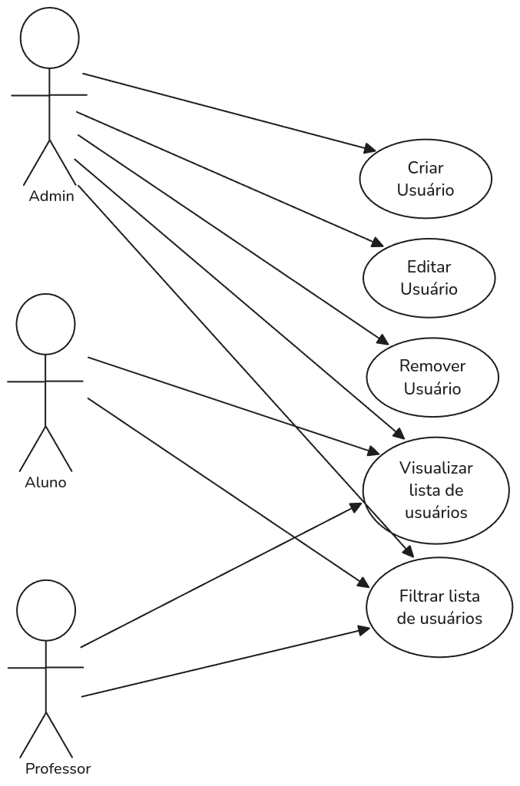

# learning-management-system

## Capítulo 1: Introdução

O projeto visa não apenas modernizar a experiência de usuário através de um design consistente e responsivo, mas também expandir o papel do LMS, transformando-o de um repositório de conteúdo em um ecossistema integrado que promove o desenvolvimento do aluno.

Para isso, propõe-se a implementação de funcionalidades de melhoria, como uma ferramenta de busca inteligente, e inovações como um sistema de recomendação de oportunidades acadêmicas e extracurriculares.

## Capítulo 2: Detalhamento do Projeto

### 2.1. Motivação

A motivação central deste projeto nasce da experiência diária como estudante universitário e da observação das dificuldades operacionais causadas pelas ferramentas de gestão de aprendizagem atualmente em uso.

A dificuldade em localizar materiais de estudo, a inconsistência na organização de conteúdo entre diferentes disciplinas e a instabilidade da plataforma resultam em interrupções no acesso ao conteúdo de aprendizagem.

Adicionalmente, identifica-se uma lacuna na centralização de informações relevantes para a jornada do aluno, como oportunidades de estágio, projetos de pesquisa e atividades de extensão, que hoje são divulgadas de forma descentralizada e assimétrica.

O objetivo é, portanto, criar uma solução que resolva esses pontos práticos e organize a experiência acadêmica, tornando-a mais fluida, integrada e personalizada.

### 2.2. Cenário Atual

O cenário de Learning Management Systems é dominado por plataformas robustas, mas que frequentemente carregam legados técnicos e de design. A análise a seguir combina a perspectiva do usuário final com tendências de mercado.

#### Perspectiva de Aluno

Como usuário direto do Moodle, os seguintes pontos são recorrentes:

- **Design e Usabilidade**: A interface é percebida como não alinhada aos padrões visuais atuais, com navegação pouco intuitiva. A falta de um padrão na estruturação do conteúdo por parte dos docentes demanda um esforço adicional do aluno para a localização de materiais em cada nova disciplina. A experiência em dispositivos móveis apresenta limitações, o que dificulta o acesso rápido a informações.

- **Desempenho e Confiabilidade**: Episódios de lentidão, indisponibilidade em períodos de alta demanda (como semanas de prova) e falhas no upload ou download de arquivos são reportados com frequência por alunos e professores. Tais ocorrências podem impactar a continuidade das atividades acadêmicas.

#### Análise de Mercado

As observações pessoais são validadas por análises mais amplas do setor de EdTech.

- **Confiabilidade como Fator Crítico**: Relatórios como o da Educause apontam consistentemente que a confiabilidade e a facilidade de uso são os fatores mais importantes para a satisfação de alunos e professores com um LMS ([Educause Horizon Report, 2023](https://library.educause.edu/-/media/files/library/2023/4/2023hrteachinglearning.pdf)). Plataformas mais modernas, nativas em nuvem, como o Canvas, utilizam essa estabilidade como um forte diferencial competitivo.

- **A Tendência de "Consumerização"**: Usuários esperam que o software educacional tenha a mesma qualidade de design e experiência de aplicativos de consumo (e.g., Spotify, Netflix). A expectativa por interfaces limpas, personalizadas e intuitivas é uma tendência de mercado que plataformas mais antigas têm dificuldade em acompanhar ([Beyond Functionality: How Consumerization of Enterprise UX is Revolutionizing Work](https://www.photonxtech.com/blogs/beyond-functionality-how-consumerization-of-enterprise-ux-is-revolutionizing-work)).

- **Ecossistemas Integrados**: A direção do mercado aponta para a criação de plataformas que servem como um "hub" central na vida do estudante, integrando-se a outras ferramentas (agendas, ferramentas de anotação) e oferecendo uma visão holística da jornada acadêmica, algo que sistemas tradicionais raramente oferecem de forma nativa.

### 2.3. Estruturação da Demanda

Com base na análise, a demanda para o novo sistema é estruturada em três esferas de atuação:

1. **Problemas (Fundamentais):** Questões centrais que afetam a usabilidade e a funcionalidade do sistema e que devem ser solucionadas na fundação do novo produto.

   - **Design Defasado e Inconsistente**: A necessidade de uma interface de usuário (UI) moderna, intuitiva e padronizada.
   - **Responsividade Deficiente:** O requisito de que a plataforma seja totalmente funcional em dispositivos móveis (mobile-first).
   - **Indisponibilidade e Instabilidade:** Embora seja um desafio de arquitetura complexo, o projeto deve ser concebido sobre uma arquitetura que priorize a escalabilidade e a confiabilidade.

2. **Melhorias (Incrementais):** Funcionalidades que aprimoram processos existentes, gerando ganhos de eficiência para o usuário.

   - **Ferramenta de Busca Difusa (Fuzzy Search):** Implementação de um sistema de busca avançado que permita encontrar termos dentro do conteúdo de documentos (PDFs, slides), mesmo com pequenas variações ou erros de digitação.
   - **Integração com Ecossistema de Ferramentas:** Capacidade de integrar-se com ferramentas externas populares entre estudantes, como Google Calendar (para sincronizar prazos) e Notion.

3. **Inovações (Diferenciais):** Novas funcionalidades que expandem o propósito do LMS e criam um valor único para o produto.
   - **Sistema de Recomendação de Oportunidades:**
     - **Perfil de Interesses do Aluno:** Área para o aluno cadastrar suas habilidades e interesses através de tags.
     - **Cadastro de Oportunidades:** Formulário para cadastro de oportunidades, também utilizando tags.
     - **Algoritmo de Recomendação (Content-Based):** Implementação inicial do motor que cruza as tags do perfil do aluno com as das oportunidades para gerar um feed personalizado.

### 2.4. Funcionalidades Fora do Escopo do MVP (Próximos Passos)

As seguintes funcionalidades, embora importantes, serão planejadas para fases futuras do projeto:

- **Ferramenta de Busca Difusa (Fuzzy Search):** Sistema de busca avançado para encontrar termos dentro do conteúdo dos documentos.

- **Integração** com APIs de ferramentas externas (Google Calendar, Notion).

## Capítulo 3: Requisitos do Sistema

### 3.1. Requisitos Funcionais

#### Módulo: Gestão de Usuários

| ID      | Requisito Funcional                                                              | Prioridade |
| ------- | -------------------------------------------------------------------------------- | ---------- |
| USU-RF1 | O sistema deve permitir criar, editar e remover usuários                         | Alta       |
| USU-RF2 | O sistema deve permitir listar usuários com paginação e filtros básicos          | Média      |
| USU-RF3 | O sistema deve permitir vincular usuários a disciplinas (roles: aluno/professor) | Média      |

#### Módulo: Autenticação e Autorização

| ID       | Requisito Funcional                                                            | Prioridade |
| -------- | ------------------------------------------------------------------------------ | ---------- |
| AUTH-RF1 | O sistema deve autenticar usuários via e-mail mackenzista e senha              | Alta       |
| AUTH-RF2 | O sistema deve permitir logout                                                 | Alta       |
| AUTH-RF3 | O sistema deve aplicar controle de acesso baseado em roles (middleware na API) | Baixo      |

#### Módulo: Gestão de Disciplinas

| ID       | Requisito Funcional                                           | Prioridade |
| -------- | ------------------------------------------------------------- | ---------- |
| DISC-RF1 | O sistema deve permitir criar, editar e remover disciplinas   | Alta       |
| DISC-RF2 | O sistema deve permitir listar disciplinas com paginação      | Alta       |
| DISC-RF3 | O sistema deve permitir upload/download de documentos         | Média      |
| DISC-RF4 | O sistema deve permitir acessar os detalhes de uma disciplina | Baixo      |

#### Módulo: Armazenamento de Arquivos

| ID       | Requisito Funcional                                             | Prioridade |
| -------- | --------------------------------------------------------------- | ---------- |
| FILE-RF1 | O sistema deve permitir upload de arquivos (PDF, slides, vídeo) | Alta       |
| FILE-RF2 | O sistema deve permitir download de arquivos                    | Média      |
| FILE-RF3 | O sistema deve permitir listar arquivos com metadados           | Baixo      |

#### Módulo: Oportunidades

| ID      | Requisito Funcional                                                               | Prioridade |
| ------- | --------------------------------------------------------------------------------- | ---------- |
| OPP-RF1 | O sistema deve permitir cadastrar oportunidades (estágio, complementar, extensão) | Alta       |
| OPP-RF2 | O sistema deve permitir listar e filtrar oportunidades                            | Alta       |
| OPP-RF4 | O sistema deve suportar um motor de recomendações (content-based filtering)       | Média      |

### 3.2. Requisitos Não Funcionais

| ID       | Categoria                    | Requisito Não Funcional                 | Critério / Métrica                                                                | Prioridade |
| -------- | ---------------------------- | --------------------------------------- | --------------------------------------------------------------------------------- | ---------- |
| SEC-NF2  | Segurança                    | Armazenamento seguro de dados sensíveis | Senhas com hashing seguro e salting (bcrypt ou Argon2)                            | Alta       |
| SEC-NF3  | Segurança                    | Controle de acesso                      | RBAC (Controle de Acesso Baseado em Função) aplicado nas APIs e aplicação web     | Média      |
| PERF-NF1 | Desempenho                   | Latência de API                         | 95% das respostas < 200 ms sob cenário de carga                                   | Alta       |
| PERF-NF2 | Desempenho                   | Upload de arquivos                      | Suportar uploads até 10 MB no MVP                                                 | Média      |
| MON-NF1  | Monitoramento                | Logs                                    | Logs de autenticação/erros com retenção de 30 dias                                | Baixa      |
| USAB-NF1 | Usabilidade e Acessibilidade | Responsividade e compatibilidade        | Mobile-first; suportar navegadores modernos                                       | Alta       |
| USAB-NF2 | Usabilidade e Acessibilidade | Acessibilidade                          | Avaliação heurística e correções críticas; meta: WCAG 2.1 AA em iterações futuras | Baixa      |

## Capítulo 4: Protótipo da Interface


> Para acessar o protótipo [clique aqui](https://learning-management-system-flame-xi.vercel.app/).

[JUSTIFICATIVA AQUI]

## Módulo: Armazenamento de Arquivos

### Diagrama de Sequencia

###### FILE-RF1


###### FILE-RF2


###### FILE-RF3


### Diagrama de classes


### Entidade MongoDb


## Capítulo 5: Modelagem do Sistema

### Casos de Uso: Visão Geral

Aluno:

- Fazer sign-in e sign-up (e-mail mackenzista e senha)
- Acessar disciplinas
- Cadastrar oportunidade (estágio, complementar e extensão)
- Feed de recomendações de oportunidades

(Opcional)

- Busca difusa (fuzzy search) em documentos
- Baixar documentos

Professor:

- Fazer upload de documentos (PDFs, slides, vídeos), com metadados (título, descrição, tags)
- Cadastrar oportunidade (estágio, complementar e extensão)

Administrador:

- Gerenciar usuários (criar, editar, remover)
- Gerenciar disciplinas (criar, editar, remover)
- Vincular professores e alunos às disciplinas

### Módulos

- [Oportunidades](./docs/modeling/opportunities.md)

### Módulo: Gestão de Usuários

#### Casos de Uso



#### Diagramas de sequência:

###### USU-RF1.1 : Criar usuário


###### USU-RF1.2 : Editar usuário


###### USU-RF1.3: Remover usuário


##### USU-RF2 : Listagem de usuários, com paginação e filtros básicos


##### USU-RF3 : Vinculação aluno/professor - Disciplina


#### Diagrama de Classes:


## Módulo: Autenticação e Autorização

###### AUTH-RF1: Autenticação via E-mail Mackenzista e Senha


###### AUTH-RF2: Sistema deve permitir Logout


###### AUTH-RF3: Controle de Acesso Baseado em Roles (Middleware)


###### Fluxo de Autenticação


###### Diagrama de Classes


###### Entidades MongoDB


### Módulo: Gestão de Disciplinas

#### Casos de uso:


#### Diagramas de sequência:

##### DISC-RF1.1 : Criar disciplina


##### DISC-RF1.2: Editar disciplina


##### DISC-RF1.3: Remover disciplina


##### DISC-RF2: Listagem de disciplinas

```mermaid
sequenceDiagram
    actor Professor/Aluno
    participant boundary as DisciplinaBoundary
    participant controller as DisciplinaController
    participant service as DisciplinaService
    participant disciplina as Disciplina

    Professor/Aluno->>boundary: solicitarListaDisciplinas(idAluno)
    boundary->>controller: listarDisciplinas(idAluno)
    controller->>service: buscarPorAluno(idAluno)
    service->>disciplina: buscarPorAluno(idAluno)
    disciplina-->>service: listaDisciplinas
    service-->>controller: listaDisciplinas
    controller-->>boundary:listaDisciplinasPaginada

```

##### DISC-RF3.1: Upload

```mermaid
sequenceDiagram
    actor Professor
    participant boundary as DocumentoBoundary
    participant controller as DocumentoController
    participant service as DocumentoService
    participant documento as Documento

    Professor->>boundary: uploadDocumento(arquivo, disciplinaId)
    boundary->>controller: uploadDocumento(arquivo, disciplinaId)
    controller->>service: armazenarDocumento(arquivo, disciplinaId)
    service->>documento: salvarArquivo(arquivo, disciplinaId)
    documento-->>service: confirmacao de upload
    service-->>controller: resposta de sucesso
    controller-->>boundary: exibe mensagem de sucesso

```

##### DISC-RF3.2: Download

```mermaid
sequenceDiagram
    actor Professor/Aluno
    participant boundary as DocumentoBoundary
    participant controller as DocumentoController
    participant service as DocumentoService
    participant documento as Documento

    Aluno->>boundary: downloadDocumento(documentoId)
    boundary->>controller: downloadDocumento(documentoId)
    controller->>service: obterDocumento(documentoId)
    service->>documento: recuperarArquivo(documentoId)
    documento-->>service: bytes do arquivo
    service-->>controller: bytes do arquivo
    controller-->>boundary: baixa o arquivo localmente

```

##### DISC-RF4: Listar documentos de uma disciplina

```mermaid
sequenceDiagram
    actor Professor/Aluno
    participant boundary as DisciplinaBoundary
    participant controller as DisciplinaController
    participant service as DisciplinaService
    participant disciplina as Disciplina

    Professor/Aluno->>boundary: solicitarCriacaoDisciplina(dadosDisciplina)
    boundary->>controller: criarDisciplina(dadosDisciplina)
    controller->>service: criarDisciplina(dadosDisciplina)
    service->>disciplina: salvar(disciplina)
    disciplina-->>service: disciplinaSalva
    service-->>controller: resposta de sucesso
    controller-->>boundary: exibe mensagem de sucesso
```

#### Diagrama de classes

```mermaid
classDiagram
    class Pessoa {
        +id: int
        +nome: string
        +email: string
        +fazerLogin(): bool
    }

    class Aluno {
        +listarDisciplinas(): List<Disciplina>
        +downloadDocumento(doc: Documento)
        +acessarConteudos(d: Disciplina)
    }

    class Professor {
        +listarDisciplinas(): List<Disciplina>
        +downloadDocumento(doc: Documento)
        +uploadDocumento(doc: Documento, d: Disciplina)
        +acessarConteudos(d: Disciplina)
    }

    class Admin {
        +criarDisciplina(d: Disciplina)
        +editarDisciplina(d: Disciplina)
        +removerDisciplina(d: Disciplina)
    }

    class Disciplina {
        +id: int
        +nome: string
        +descricao: string
    }

    class Documento {
        +id: int
        +titulo: string
        +tipo: string
        +arquivo: blob
    }

    Pessoa <|-- Aluno
    Pessoa <|-- Professor
    Pessoa <|-- Admin

    Aluno "*" --> "*" Disciplina : "matriculado em"
    Professor "1" --> "*" Disciplina : "leciona"
    Disciplina "1" --> "*" Documento : "contém"

```
