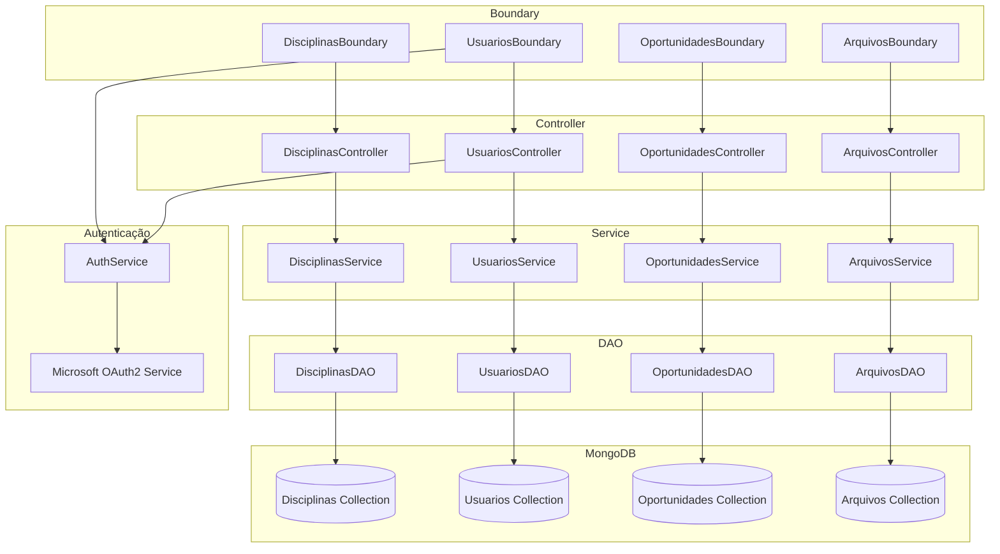
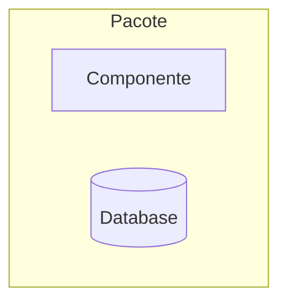

# Arquitetura

```mermaid
%%{init: {'theme': 'default'}}%%
graph TB
    subgraph Boundary
        Boundary_Disciplinas[DisciplinasBoundary]
        Boundary_Usuarios[UsuariosBoundary]
        Boundary_Oportunidades[OportunidadesBoundary]
        Boundary_Arquivos[ArquivosBoundary]
    end

    subgraph Controller
        Controller_Disciplinas[DisciplinasController]
        Controller_Usuarios[UsuariosController]
        Controller_Oportunidades[OportunidadesController]
        Controller_Arquivos[ArquivosController]
    end

    subgraph Service
        Service_Disciplinas[DisciplinasService]
        Service_Usuarios[UsuariosService]
        Service_Oportunidades[OportunidadesService]
        Service_Arquivos[ArquivosService]
    end

    subgraph DAO
        DAO_Disciplinas[DisciplinasDAO]
        DAO_Usuarios[UsuariosDAO]
        DAO_Oportunidades[OportunidadesDAO]
        DAO_Arquivos[ArquivosDAO]
    end

    subgraph MongoDB
        DB_Disciplinas[(Disciplinas Collection)]
        DB_Usuarios[(Usuarios Collection)]
        DB_Oportunidades[(Oportunidades Collection)]
        DB_Arquivos[(Arquivos Collection)]
    end

    subgraph Autenticação
        MicrosoftOAuth2[Microsoft OAuth2 Service]
        AuthService[AuthService]
    end

    %% Conexões principais
    Boundary_Disciplinas --> Controller_Disciplinas
    Boundary_Usuarios --> Controller_Usuarios
    Boundary_Oportunidades --> Controller_Oportunidades
    Boundary_Arquivos --> Controller_Arquivos

    Controller_Disciplinas --> Service_Disciplinas
    Controller_Usuarios --> Service_Usuarios
    Controller_Oportunidades --> Service_Oportunidades
    Controller_Arquivos --> Service_Arquivos

    Service_Disciplinas --> DAO_Disciplinas
    Service_Usuarios --> DAO_Usuarios
    Service_Oportunidades --> DAO_Oportunidades
    Service_Arquivos --> DAO_Arquivos

    DAO_Disciplinas --> DB_Disciplinas
    DAO_Usuarios --> DB_Usuarios
    DAO_Oportunidades --> DB_Oportunidades
    DAO_Arquivos --> DB_Arquivos

    %% Autenticação
    Boundary_Usuarios --> AuthService
    Controller_Usuarios --> AuthService
    AuthService --> MicrosoftOAuth2

```
## Legenda:

```mermaid
%%{init: {'theme': 'default'}}%%
graph TB
subgraph Pacote[Pacote]
        Componente[Componente]
        Database[(Database)]
    end
```