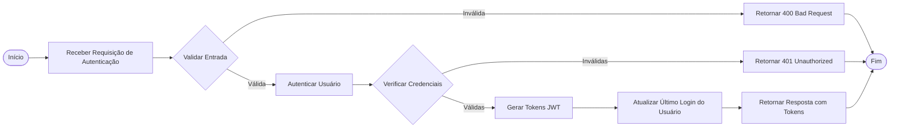
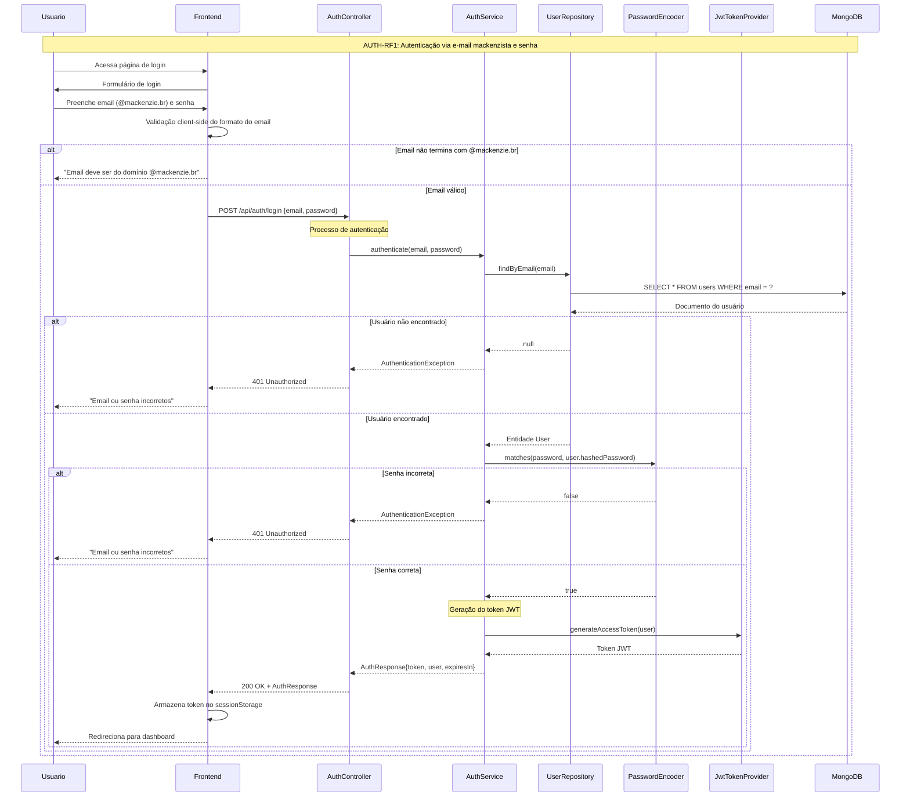
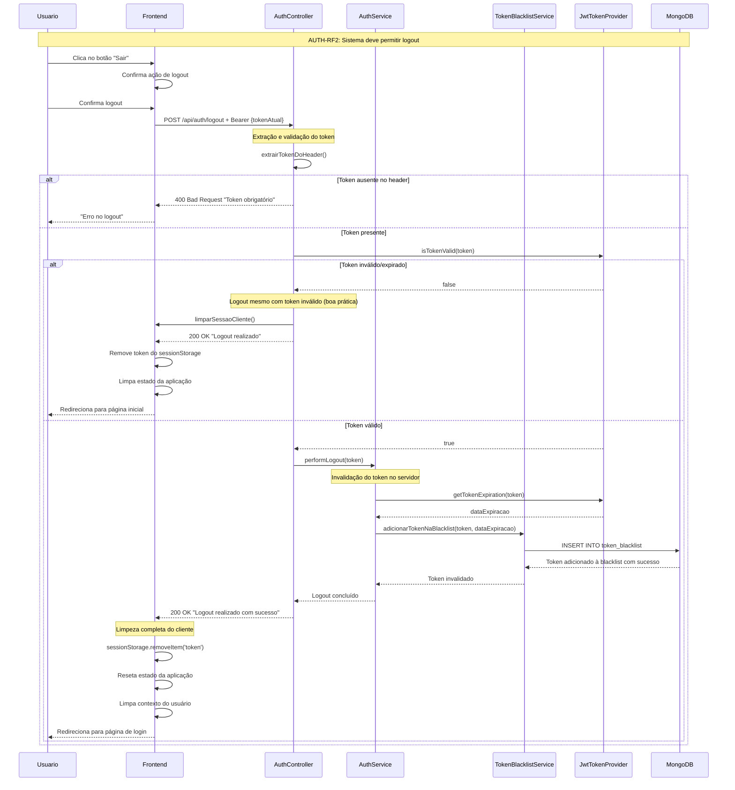
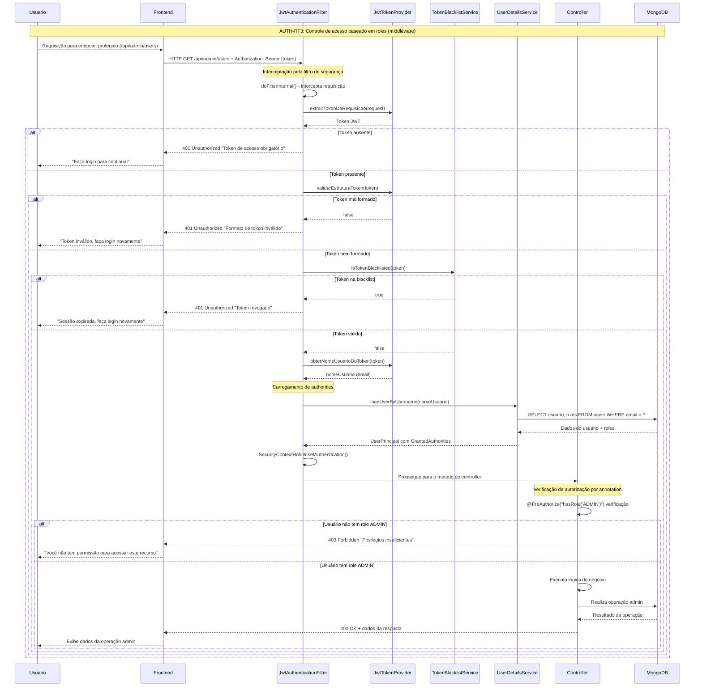
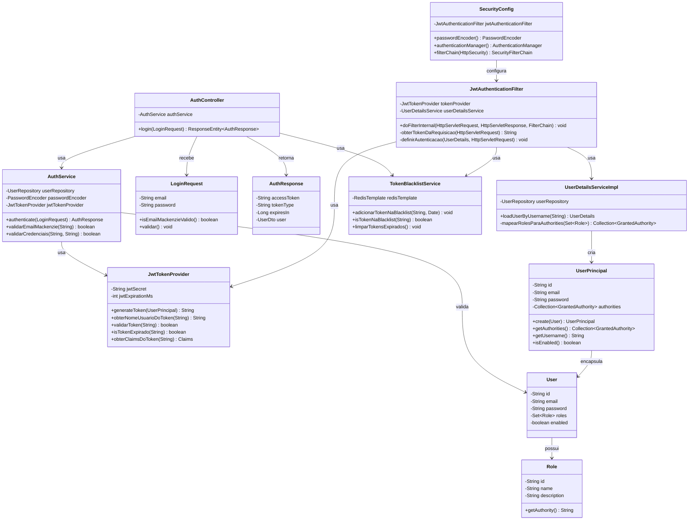

# Modelagem do módulo de "Autenticação e Autorização"

## Fluxo de Autenticação

## Diagramas de Sequência

### AUTH-RF1: Autenticação via E-mail Mackenzista e Senha

### AUTH-RF2: Sistema deve permitir Logout

### AUTH-RF3: Controle de Acesso Baseado em Roles (Middleware)

## Diagrama de Classes

