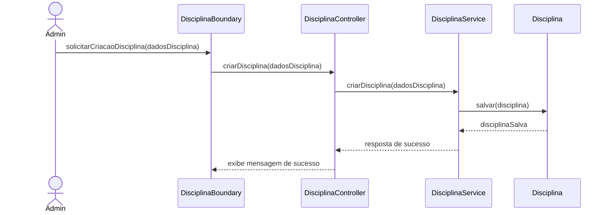
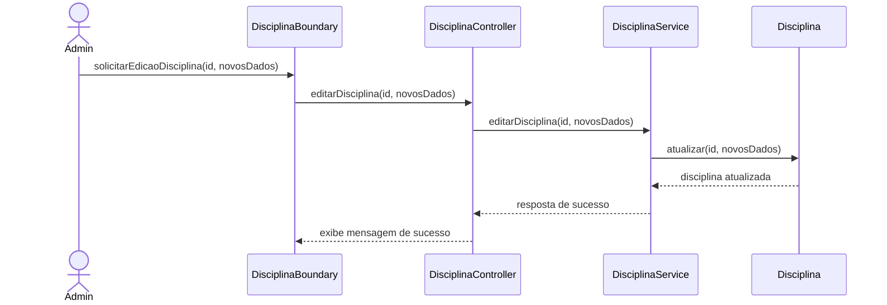
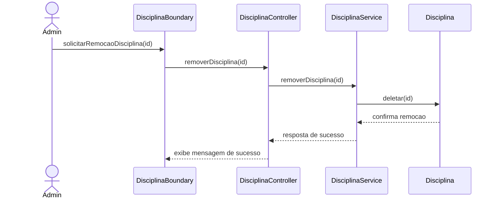
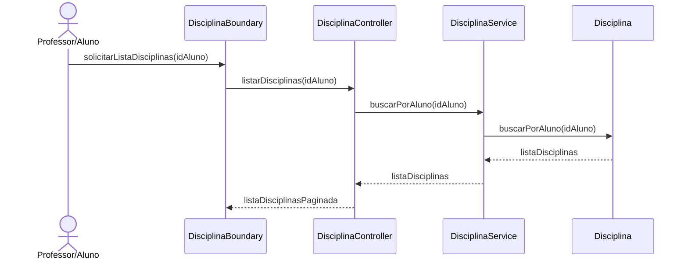
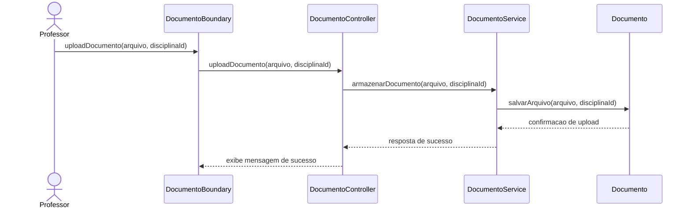
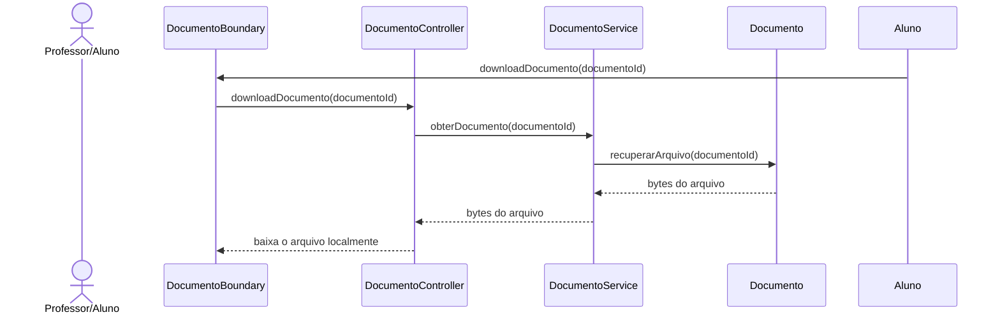
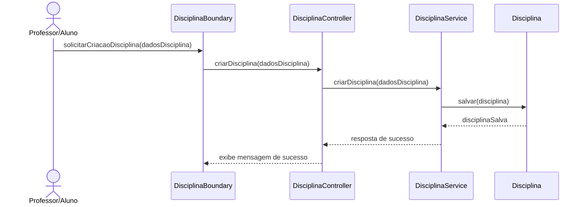
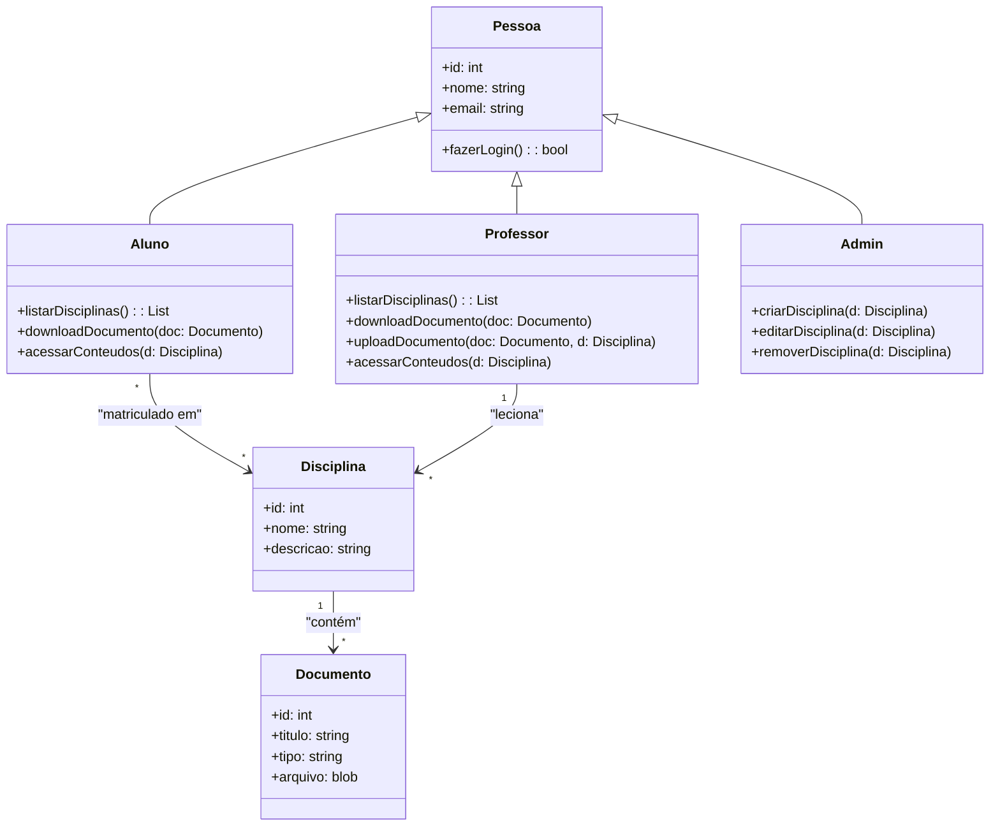

#### Casos de uso:

#### Diagramas de sequência:

##### DISC-RF1.1 : Criar disciplina

##### DISC-RF1.2: Editar disciplina

##### DISC-RF1.3: Remover disciplina

##### DISC-RF2: Listagem de disciplinas

##### DISC-RF3.1: Upload

##### DISC-RF3.2: Download

##### DISC-RF4: Listar documentos de uma disciplina

#### Diagrama de classes

