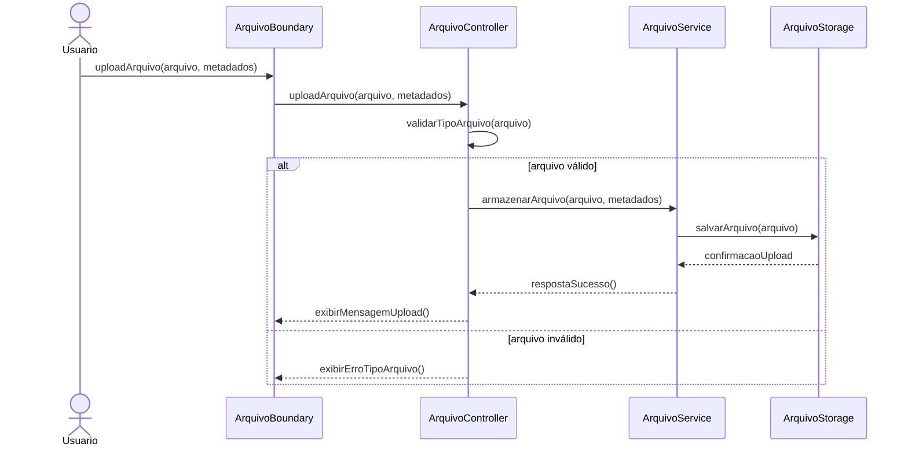
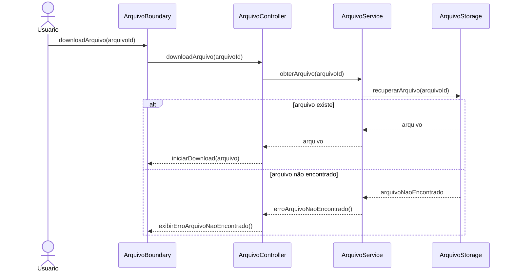
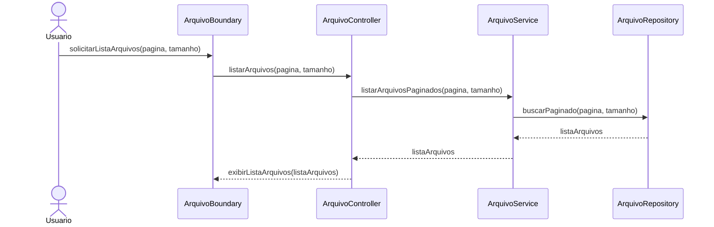
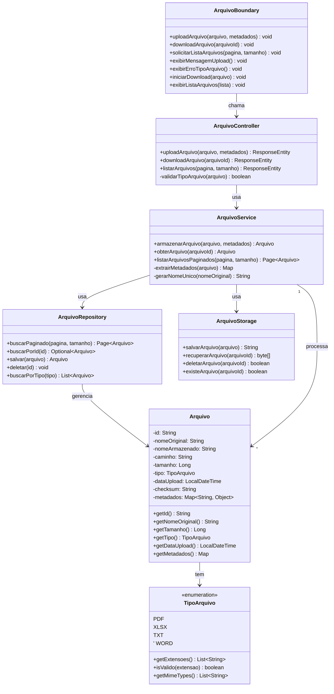
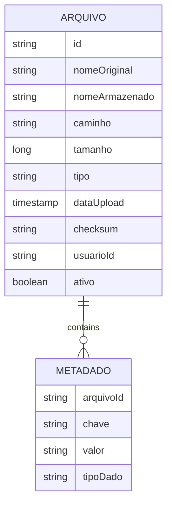

# Modelagem do módulo "Arquivos"

## Diagrama de Sequência

### FILE-RF1

```mermaid
sequenceDiagram
    actor Usuario
    participant boundary as ArquivoBoundary
    participant controller as ArquivoController
    participant service as ArquivoService
    participant storage as ArquivoStorage

    Usuario->>boundary: uploadArquivo(arquivo, metadados)
    boundary->>controller: uploadArquivo(arquivo, metadados)
    controller->>controller: validarTipoArquivo(arquivo)
    alt arquivo válido
        controller->>service: armazenarArquivo(arquivo, metadados)
        service->>storage: salvarArquivo(arquivo)
        storage-->>service: confirmacaoUpload
        service-->>controller: respostaSucesso()
        controller-->>boundary: exibirMensagemUpload()
    else arquivo inválido
        controller-->>boundary: exibirErroTipoArquivo()
    end
```

### FILE-RF2

```mermaid
sequenceDiagram
    actor Usuario
    participant boundary as ArquivoBoundary
    participant controller as ArquivoController
    participant service as ArquivoService
    participant storage as ArquivoStorage

    Usuario->>boundary: downloadArquivo(arquivoId)
    boundary->>controller: downloadArquivo(arquivoId)
    controller->>service: obterArquivo(arquivoId)
    service->>storage: recuperarArquivo(arquivoId)
    alt arquivo existe
        storage-->>service: arquivo
        service-->>controller: arquivo
        controller-->>boundary: iniciarDownload(arquivo)
    else arquivo não encontrado
        storage-->>service: arquivoNaoEncontrado
        service-->>controller: erroArquivoNaoEncontrado()
        controller-->>boundary: exibirErroArquivoNaoEncontrado()
    end
```

### FILE-RF3

```mermaid
sequenceDiagram
    actor Usuario
    participant boundary as ArquivoBoundary
    participant controller as ArquivoController
    participant service as ArquivoService
    participant repo as ArquivoRepository

    Usuario->>boundary: solicitarListaArquivos(pagina, tamanho)
    boundary->>controller: listarArquivos(pagina, tamanho)
    controller->>service: listarArquivosPaginados(pagina, tamanho)
    service->>repo: buscarPaginado(pagina, tamanho)
    repo-->>service: listaArquivos
    service-->>controller: listaArquivos
    controller-->>boundary: exibirListaArquivos(listaArquivos)
```

## Diagrama de Classes

```mermaid
classDiagram
    class ArquivoBoundary {
        +uploadArquivo(arquivo, metadados) void
        +downloadArquivo(arquivoId) void
        +solicitarListaArquivos(pagina, tamanho) void
        +exibirMensagemUpload() void
        +exibirErroTipoArquivo() void
        +iniciarDownload(arquivo) void
        +exibirListaArquivos(lista) void
    }

    class ArquivoController {
        +uploadArquivo(arquivo, metadados) ResponseEntity
        +downloadArquivo(arquivoId) ResponseEntity
        +listarArquivos(pagina, tamanho) ResponseEntity
        -validarTipoArquivo(arquivo) boolean
    }

    class ArquivoService {
        +armazenarArquivo(arquivo, metadados) Arquivo
        +obterArquivo(arquivoId) Arquivo
        +listarArquivosPaginados(pagina, tamanho) Page~Arquivo~
        -extrairMetadados(arquivo) Map
        -gerarNomeUnico(nomeOriginal) String
    }

    class ArquivoRepository {
        +buscarPaginado(pagina, tamanho) Page~Arquivo~
        +buscarPorId(id) Optional~Arquivo~
        +salvar(arquivo) Arquivo
        +deletar(id) void
        +buscarPorTipo(tipo) List~Arquivo~
    }

    class ArquivoStorage {
        +salvarArquivo(arquivo) String
        +recuperarArquivo(arquivoId) byte[]
        +deletarArquivo(arquivoId) boolean
        +existeArquivo(arquivoId) boolean
    }

    class Arquivo {
        -id: String
        -nomeOriginal: String
        -nomeArmazenado: String
        -caminho: String
        -tamanho: Long
        -tipo: TipoArquivo
        -dataUpload: LocalDateTime
        -checksum: String
        -metadados: Map~String, Object~
        +getId() String
        +getNomeOriginal() String
        +getTamanho() Long
        +getTipo() TipoArquivo
        +getDataUpload() LocalDateTime
        +getMetadados() Map
    }

    class TipoArquivo {
        <<enumeration>>
        PDF
        XLSX
        TXT
'       WORD
        +getExtensoes() List~String~
        +isValido(extensao) boolean
        +getMimeTypes() List~String~
    }

    ArquivoBoundary --> ArquivoController : chama
    ArquivoController --> ArquivoService : usa
    ArquivoService --> ArquivoRepository : usa
    ArquivoService --> ArquivoStorage : usa
    ArquivoRepository --> Arquivo : gerencia
    Arquivo --> TipoArquivo : tem
    ArquivoService "1" --> "*" Arquivo : processa
```

## Entidade MongoDB

```mermaid
erDiagram
    ARQUIVO ||--o{ METADADO : contains

    ARQUIVO {
        string id
        string nomeOriginal
        string nomeArmazenado
        string caminho
        long tamanho
        string tipo
        timestamp dataUpload
        string checksum
        string usuarioId
        boolean ativo
    }

    METADADO {
        string arquivoId
        string chave
        string valor
        string tipoDado
    }
```