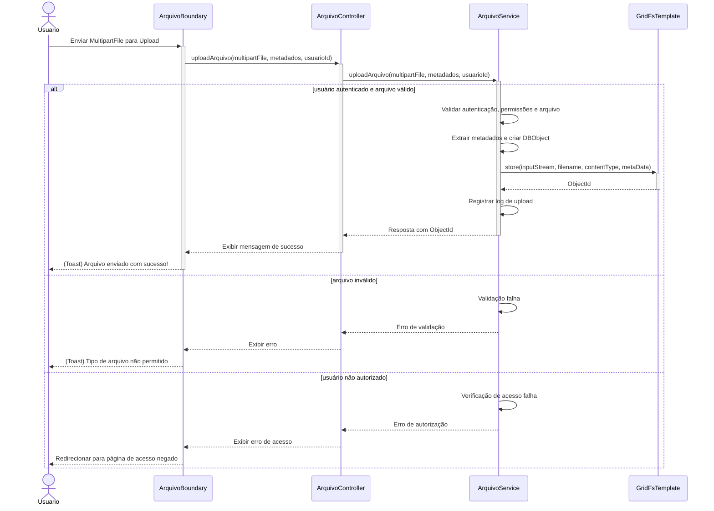
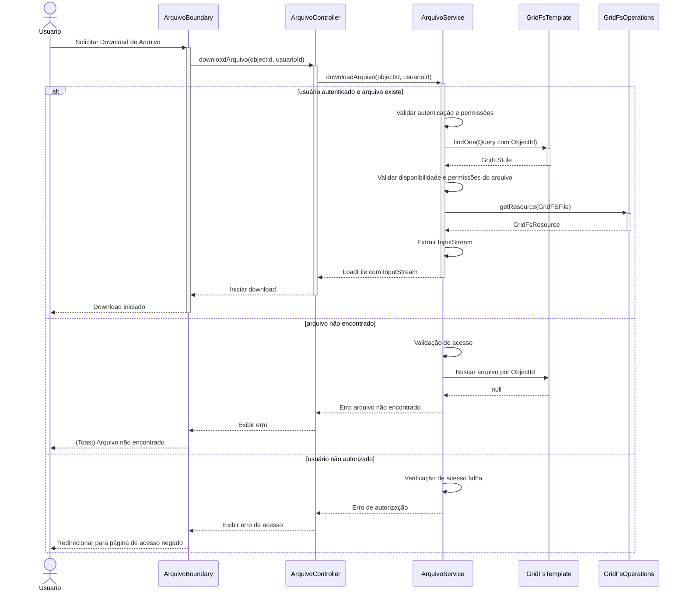
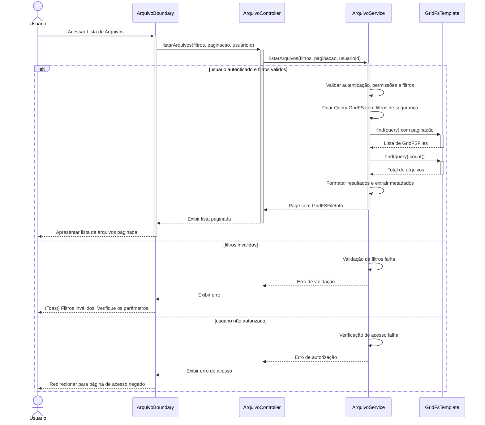
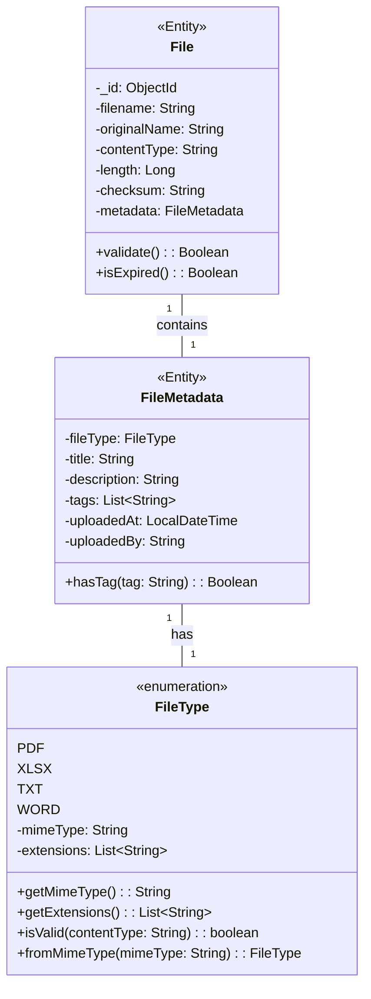

# Modelagem do módulo "Arquivos"

## Diagrama de Sequência

### FILE-RF1: Upload de arquivo

```mermaid
sequenceDiagram
    actor Usuario
    participant boundary as ArquivoBoundary
    participant controller as ArquivoController
    participant service as ArquivoService
    participant gridFsTemplate as GridFsTemplate

    Usuario->>+boundary: Enviar MultipartFile para Upload
    boundary->>+controller: uploadArquivo(multipartFile, metadados, usuarioId)
    controller->>+service: uploadArquivo(multipartFile, metadados, usuarioId)
    
    alt usuário autenticado e arquivo válido
        service->>service: Validar autenticação, permissões e arquivo
        service->>service: Extrair metadados e criar DBObject
        service->>+gridFsTemplate: store(inputStream, filename, contentType, metaData)
        gridFsTemplate-->>-service: ObjectId
        service->>service: Registrar log de upload
        service-->>-controller: Resposta com ObjectId
        controller-->>-boundary: Exibir mensagem de sucesso
        boundary-->>-Usuario: (Toast) Arquivo enviado com sucesso!
    else arquivo inválido
        service->>service: Validação falha
        service-->>controller: Erro de validação
        controller-->>boundary: Exibir erro
        boundary-->>Usuario: (Toast) Tipo de arquivo não permitido
    else usuário não autorizado
        service->>service: Verificação de acesso falha
        service-->>controller: Erro de autorização
        controller-->>boundary: Exibir erro de acesso
        boundary-->>Usuario: Redirecionar para página de acesso negado
    end
```

### FILE-RF2: Download de arquivo

```mermaid
sequenceDiagram
    actor Usuario
    participant boundary as ArquivoBoundary
    participant controller as ArquivoController
    participant service as ArquivoService
    participant gridFsTemplate as GridFsTemplate
    participant gridFsOperations as GridFsOperations

    Usuario->>+boundary: Solicitar Download de Arquivo
    boundary->>+controller: downloadArquivo(objectId, usuarioId)
    controller->>+service: downloadArquivo(objectId, usuarioId)
    
    alt usuário autenticado e arquivo existe
        service->>service: Validar autenticação e permissões
        service->>+gridFsTemplate: findOne(Query com ObjectId)
        gridFsTemplate-->>-service: GridFSFile
        service->>service: Validar disponibilidade e permissões do arquivo
        service->>+gridFsOperations: getResource(GridFSFile)
        gridFsOperations-->>-service: GridFsResource
        service->>service: Extrair InputStream
        service-->>-controller: LoadFile com InputStream
        controller-->>-boundary: Iniciar download
        boundary-->>-Usuario: Download iniciado
    else arquivo não encontrado
        service->>service: Validação de acesso
        service->>gridFsTemplate: Buscar arquivo por ObjectId
        gridFsTemplate-->>service: null
        service-->>controller: Erro arquivo não encontrado
        controller-->>boundary: Exibir erro
        boundary-->>Usuario: (Toast) Arquivo não encontrado
    else usuário não autorizado
        service->>service: Verificação de acesso falha
        service-->>controller: Erro de autorização
        controller-->>boundary: Exibir erro de acesso
        boundary-->>Usuario: Redirecionar para página de acesso negado
    end
```

### FILE-RF3: Listagem de arquivos

```mermaid
sequenceDiagram
    actor Usuario
    participant boundary as ArquivoBoundary
    participant controller as ArquivoController
    participant service as ArquivoService
    participant gridFsTemplate as GridFsTemplate

    Usuario->>+boundary: Acessar Lista de Arquivos
    boundary->>+controller: listarArquivos(filtros, paginacao, usuarioId)
    controller->>+service: listarArquivos(filtros, paginacao, usuarioId)
    
    alt usuário autenticado e filtros válidos
        service->>service: Validar autenticação, permissões e filtros
        service->>service: Criar Query GridFS com filtros de segurança
        service->>+gridFsTemplate: find(query) com paginação
        gridFsTemplate-->>-service: Lista de GridFSFiles
        service->>+gridFsTemplate: find(query).count()
        gridFsTemplate-->>-service: Total de arquivos
        service->>service: Formatar resultados e extrair metadados
        service-->>-controller: Page com GridFSFileInfo
        controller-->>-boundary: Exibir lista paginada
        boundary-->>-Usuario: Apresentar lista de arquivos paginada
    else filtros inválidos
        service->>service: Validação de filtros falha
        service-->>controller: Erro de validação
        controller-->>boundary: Exibir erro
        boundary-->>Usuario: (Toast) Filtros inválidos. Verifique os parâmetros.
    else usuário não autorizado
        service->>service: Verificação de acesso falha
        service-->>controller: Erro de autorização
        controller-->>boundary: Exibir erro de acesso
        boundary-->>Usuario: Redirecionar para página de acesso negado
    end
```

## Diagrama de Classes

```mermaid
classDiagram
    class File {
        <<Entity>>
        -_id: ObjectId
        -filename: String
        -originalName: String
        -contentType: String
        -length: Long
        -checksum: String
        -metadata: FileMetadata
        +validate(): Boolean
        +isExpired(): Boolean
    }

    class FileMetadata {
        <<Entity>>
        -fileType: FileType
        -title: String
        -description: String
        -tags: List~String~
        -uploadedAt: LocalDateTime
        -uploadedBy: String
        +hasTag(tag: String): Boolean
    }

    class FileType {
        <<enumeration>>
        PDF
        XLSX
        TXT
        WORD
        -mimeType: String
        -extensions: List~String~
        +getMimeType(): String
        +getExtensions(): List~String~
        +isValid(contentType: String): boolean
        +fromMimeType(mimeType: String): FileType
    }

    File "1" -- "1" FileMetadata : contains
    FileMetadata "1" -- "1" FileType : has
```
