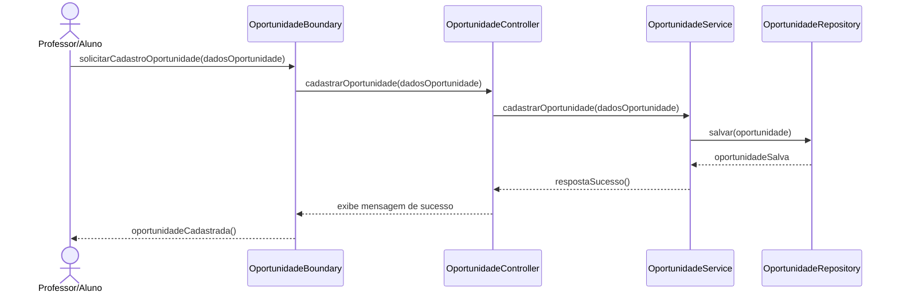
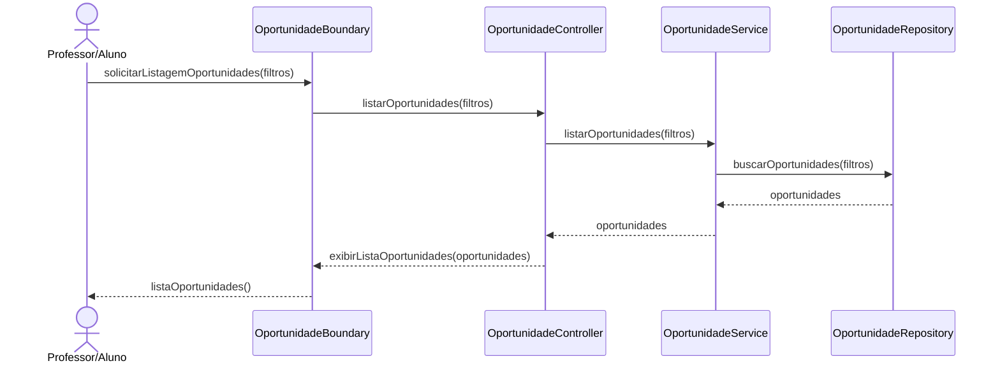
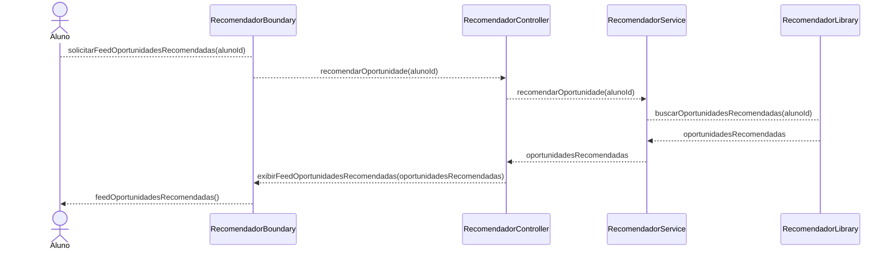

# Modelagem do módulo de "Sistema de Recomendação de Oportunidades"

## Diagrama de Sequência

### OPP-RF1: Cadastrar oportunidade

### OPP-RF2: Listagem de oportunidades

### OPP-RF3: Recomendar oportunidade

