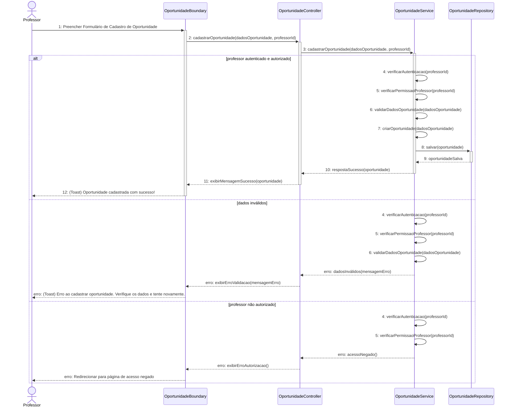
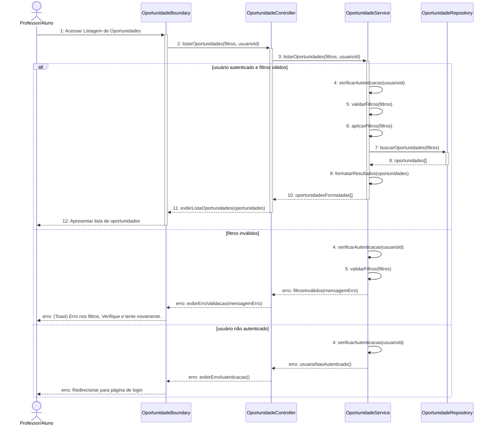
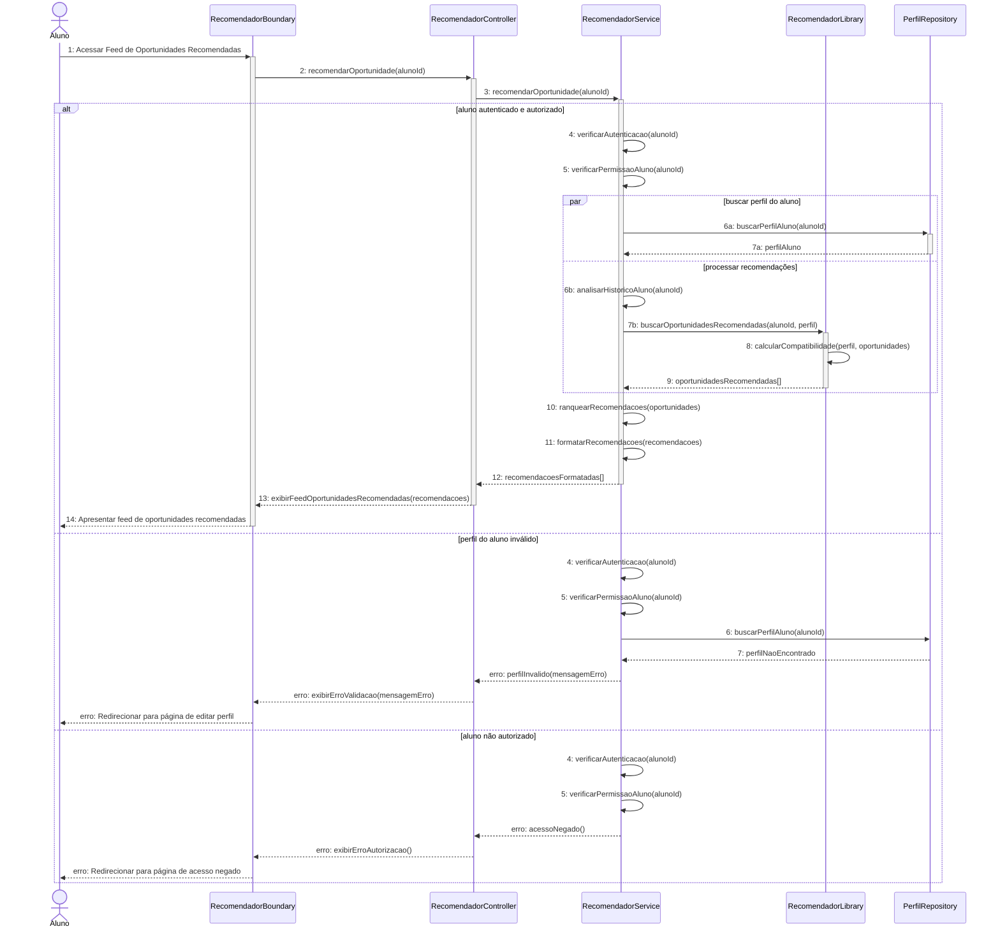
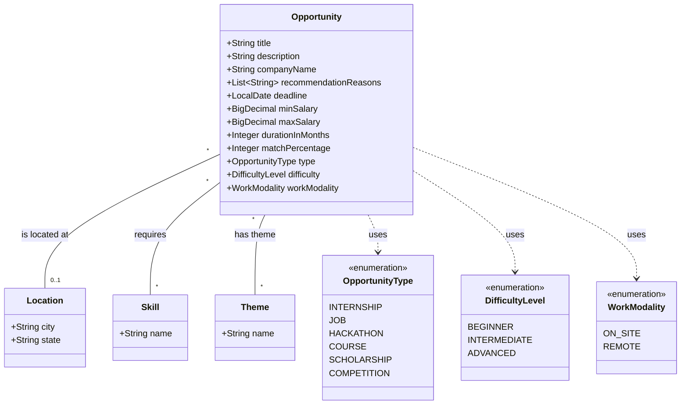

# Modelagem do módulo de "Oportunidades"

## Diagrama de Casos de Uso

A relação entre "Recomendar Oportunidades" e "Gerenciar Perfil" é do tipo "extend", indicando que a recomendação de oportunidades pode depender do gerenciamento do perfil do usuário. De forma mais detalhada, conforme o diagrama de sequência do caso de uso "Recomendar Oportunidades", o sistema verifica o perfil do aluno é válido antes de gerar as recomendações. Se o perfil estiver incompleto ou inválido, o sistema pode solicitar ao aluno que atualize seu perfil para melhorar a precisão das recomendações.

## Diagrama de Sequência

### OPP-RF1: Cadastrar oportunidade

### OPP-RF2: Listagem de oportunidades

### OPP-RF3: Recomendar oportunidade

## Diagrama de Classes

Se a oportunidade for do tipo "INTERNSHIP" ou "JOB", os atributos `minSalary`, `maxSalary`, `durationInMonths` e `workModality` devem ser obrigatoriamente preenchidos. Se a oportunidade for do tipo "COURSE", "HACKATHON", "SCHOLARSHIP" ou "COMPETITION", esses atributos podem ser nulos.

Se a modalidade de trabalho for "ON_SITE", o atributo `location` deve ser obrigatoriamente preenchido. Se a modalidade for "REMOTE", o atributo `location` pode ser nulo.