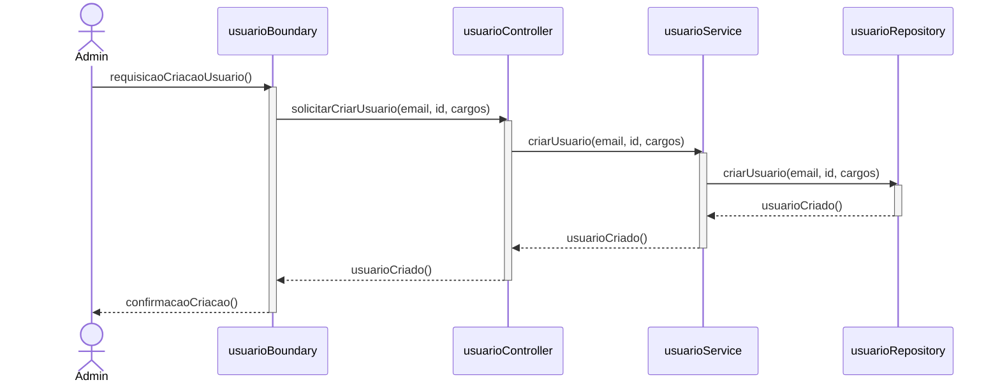
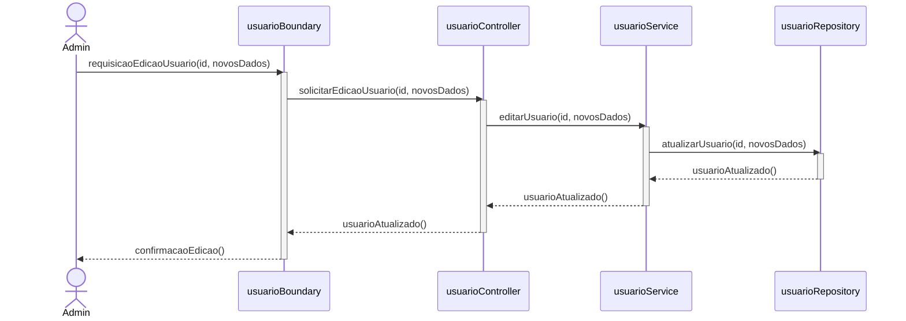
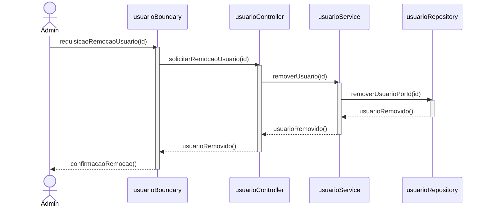
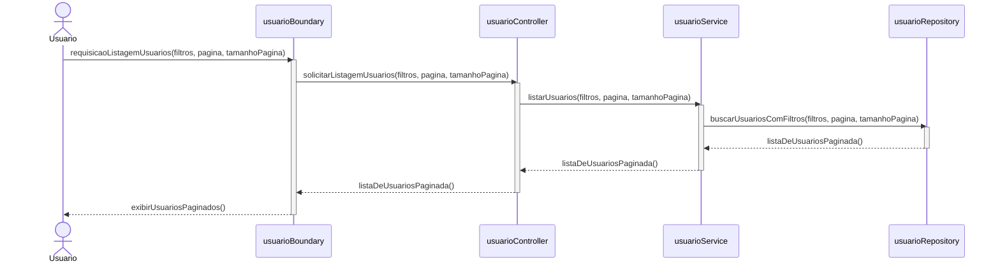
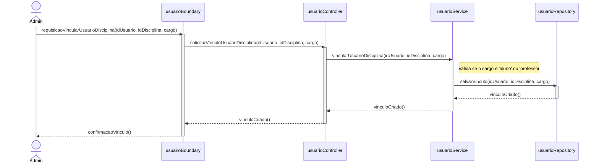
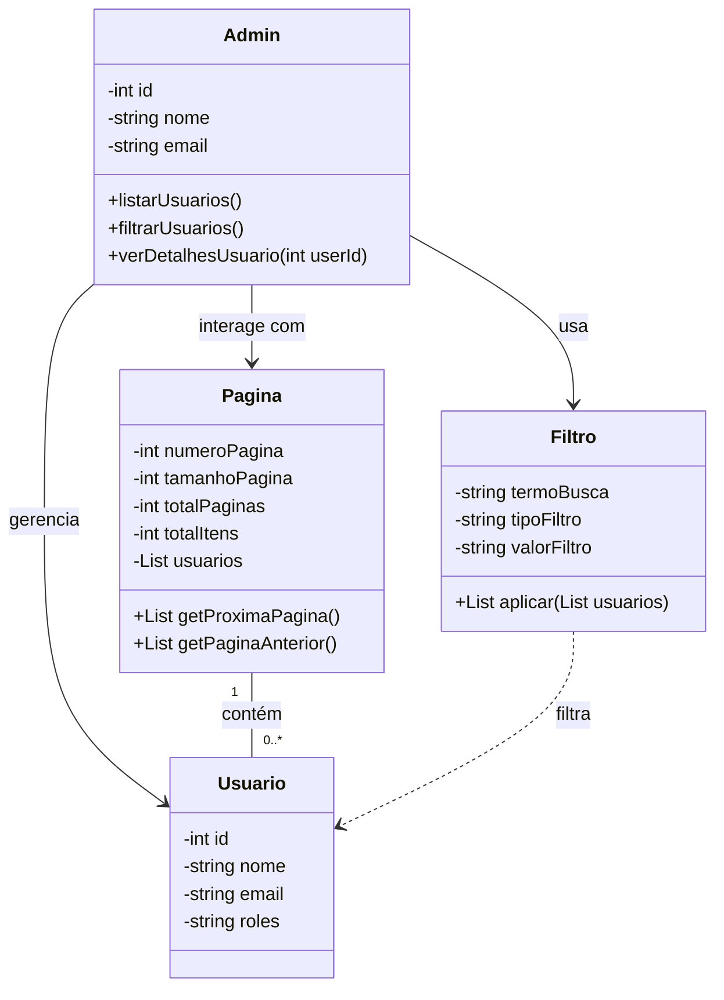

# Modelagem do módulo de "Usuários"

## Casos de Uso

## Diagramas de Sequência

### USU-RF1.1: Criar usuário

### USU-RF1.2: Editar usuário

### USU-RF1.3: Remover usuário

### USU-RF2: Listagem de usuários, com paginação e filtros básicos

### USU-RF3: Vinculação aluno/professor à disciplina

## Diagrama de Classes

